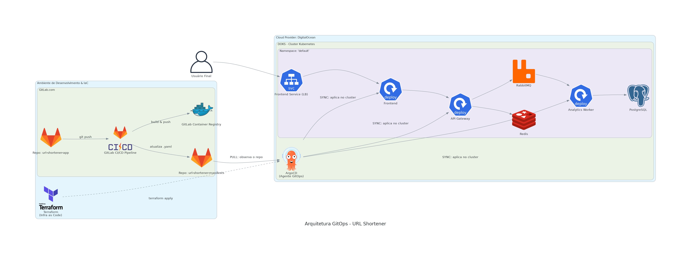

# 🚀 Projeto de DevOps: Encurtador de URL com Microserviços e GitOps

      

## 📄 Visão Geral do Projeto

Este repositório documenta a criação e implantação de um **Encurtador de URLs** utilizando uma arquitetura moderna de microserviços. O projeto demonstra um fluxo de trabalho DevOps completo, desde o provisionamento da infraestrutura como código até o deploy contínuo automatizado com GitOps, servindo como um case prático de habilidades prontas para produção.

A aplicação permite encurtar URLs e rastrear os cliques de forma assíncrona, garantindo alta performance e resiliência.

## 🛠️ Tecnologias e Pilares DevOps Demonstrados

| Pilar DevOps | Ferramentas e Conceitos Aplicados |
| :--- | :--- |
| **Infraestrutura como Código (IaC)** | **Terraform** para provisionar e gerenciar de forma automatizada o cluster **Kubernetes (DOKS)** na **DigitalOcean**. |
| **Containerização** | **Docker** para empacotar cada microserviço (`Frontend`, `API Gateway`, `Worker`) em imagens otimizadas, utilizando **builds multi-stage**. |
| **CI (Integração Contínua)** | **GitLab CI/CD** para automatizar os processos de `linting` (Hadolint), testes, `build`, scan de vulnerabilidades com **Trivy** e `push` das imagens para o **GitLab Container Registry**. |
| **CD (Deploy Contínuo) & GitOps** | **ArgoCD** para implementar o deploy contínuo. O ArgoCD monitora um repositório de manifestos e sincroniza automaticamente o estado do cluster com o declarado no Git, seguindo o paradigma **pull-based**. |
| **Arquitetura de Microserviços** | A aplicação é desacoplada em serviços independentes que se comunicam via APIs e mensageria, aumentando a resiliência e a escalabilidade. |
| **Mensageria e Cache** | **RabbitMQ** como message broker para processamento assíncrono de analytics, e **Redis** como banco de dados de alta velocidade para mapeamento das URLs. |
| **Orquestração** | **Kubernetes** para orquestrar todos os contêineres, gerenciando o deploy, a rede (`Services`) e a persistência de dados (`PersistentVolumeClaim`) para o **PostgreSQL**. |

---

## 🏛️ Arquitetura da Solução

O diagrama abaixo, gerado com a abordagem de "Diagrams as Code" (Python), ilustra o fluxo completo da arquitetura implementada.

O fluxo de trabalho funciona da seguinte forma:
1.  **Desenvolvimento:** O desenvolvedor envia o código para o repositório da aplicação no **GitLab**.
2.  **CI Pipeline:** O `push` aciona a pipeline no **GitLab CI/CD**, que executa testes, linting, build, scan de vulnerabilidades e push das imagens para o **GitLab Container Registry**, além de atualizar a tag da imagem no **repositório de manifestos**.
3.  **Deploy com GitOps:** O **ArgoCD**, rodando no cluster **Kubernetes**, detecta a alteração no repositório de manifestos e "puxa" os novos manifestos, atualizando a aplicação em produção sem intervenção manual.
4.  **Acesso:** O usuário final acessa a aplicação através de um **Load Balancer** da DigitalOcean.

---

## ✨ Showcase do Projeto

### 🚀 Aplicação em Produção
*A aplicação URL Shortener, após o deploy bem-sucedido via ArgoCD, acessível publicamente.*

### 🔄 Pipeline de CI/CD (GitLab)
*O workflow do GitLab Actions mostrando a execução de todos os estágios (Qualidade, Teste, Build & Scan, Deploy) sendo concluídos com sucesso.*

### 🛡️ Scan de Vulnerabilidades em Ação (Trivy)
*Evidência da etapa de DevSecOps, onde a pipeline falhou ao detectar vulnerabilidades `HIGH` na imagem base do Nginx, bloqueando o deploy. O problema foi resolvido atualizando a tag da imagem no Dockerfile.*

### 📨 Mensageria Assíncrona (RabbitMQ)
*Painel de gerenciamento do RabbitMQ rodando no cluster, mostrando a fila "clicks" pronta para receber e processar eventos de forma desacoplada e resiliente.*

### 🤖 Deploy Contínuo com GitOps (ArgoCD)
*Visão do ArgoCD com todos os recursos da aplicação sincronizados e saudáveis (`Healthy`), demonstrando que o estado do cluster espelha fielmente o repositório de manifestos.*

---

## 🎓 Conclusão

Este projeto foi uma imersão prática no ecossistema DevOps, transformando uma aplicação de microserviços em um sistema totalmente automatizado, desde a infraestrutura como código com **Terraform** até o deploy contínuo com **GitLab CI** e **ArgoCD**.

Os principais resultados foram a criação de uma pipeline resiliente que garante a qualidade e a segurança do código, e a implementação de um fluxo de **GitOps** que torna os deploys mais seguros e rastreáveis.

### 🚀 Próximos Passos
* **Implementar Testes de Carga:** Usar K6 para analisar a performance sob estresse.
* **Adicionar Observabilidade Completa:** Integrar Logging (Loki) e Tracing (Jaeger) para uma visão 360º do sistema.
* **Otimização de Custos:** Explorar o uso do KEDA para escalar os workers de forma orientada a eventos.
